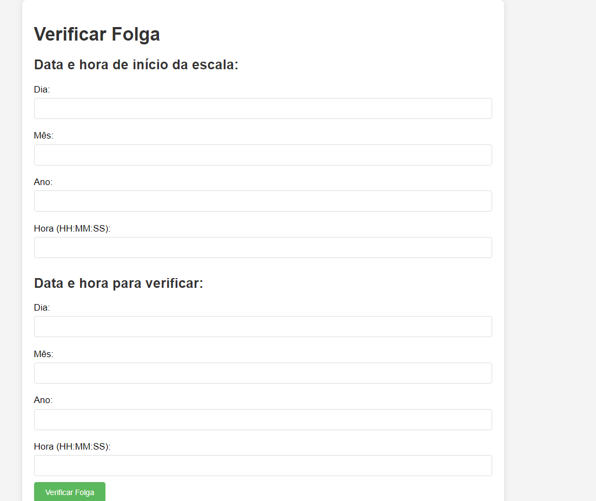

# Sobre Mim

## Olá! Sou Xavier

Sou um estudante de Análise e Desenvolvimento de Sistemas e estou apaixonado por aprender e crescer na área de programação web. Estou sempre em busca de novos desafios e oportunidades para melhorar minhas habilidades.

### Habilidades

- **Linguagens de Programação**: Python, JavaScript, etc.
- **Ferramentas e Tecnologias**: Git, VSCode, etc.

### Projetos

- **Verificador de Folga**  
  Um projeto desenvolvido para calcular e verificar as escalas de plantão em um sistema 12x36. O objetivo é permitir que o usuário insira sua escala de plantão e veja quais dias estará de folga ou trabalhando.  
    
  [[Link para o projeto ou repositório](https://github.com/Xavier-sa/EscalaPlant-o12x36)]

### Conecte-se Comigo

- **LinkedIn**: [https://www.linkedin.com/in/wellington-xavier-90a004300/](https://www.linkedin.com/in/wellington-xavier-90a004300/)
- **GitHub**: [https://github.com/Xavier-sa](https://github.com/Xavier-sa)

### Sobre Este Repositório

Este repositório contém projetos e código que estou desenvolvendo. Sinta-se à vontade para explorar, contribuir ou abrir um problema (issue) se você encontrar algo que possa ser melhorado.

Obrigado por visitar meu perfil! Se você tiver alguma dúvida ou quiser colaborar, estou aberto a sugestões e feedback.

---

*Atualizado em 05/08/2024*
